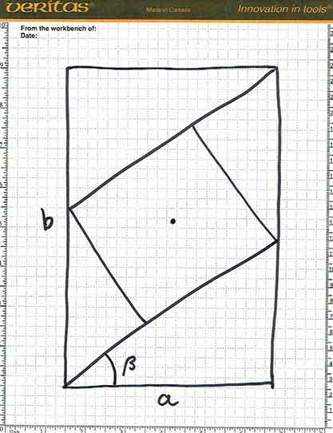
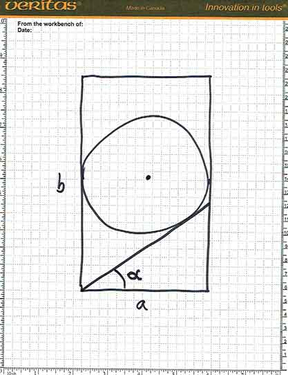
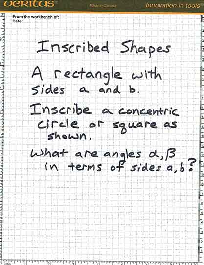
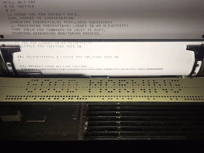
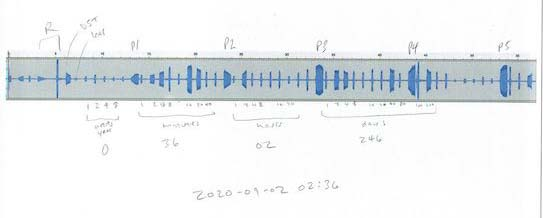

# Deviations CTF Report

DRAFT 2020-09-20 ptw

__Deviations__ was the Capture-the-Flag competition held in conjunction
with [GNU Radio Conference 2020](https://www.gnuradio.org/grcon/grcon20/),
held online as with most things in 2020. Deviations was organized by
Abraxas3d (Michelle Thompson) and Paul Williamson.

It was a so-called Jeopardy-style CTF, where the players were presented with
challenges to solve, where the solution was in the form of a specially
formatted "flag". In some CTF activities, players attack and defend
against each other, but in the Jeopardy style they each work only against
the presented challenges. Players were allowed to work individually or in a
team under a single team name. Most apparently chose to play as individuals.

Since there was no physical conference at which to hold the event, all
parts of the CTF were held online. There were two primary online locations
where CTF activity took place: the CTF server and the chat server. The CTF
server registered players, presented challenges, scored their submissions
of flags, and served as a scoreboard for the CTF. It was a Linode-hosted
virtual machine running CTFd software under Ubuntu Linux, located at
[https://grcon-ctf.online](https://grcon-ctf.online). The chat server
was a dedicated room in the GNU Radio chat, where all conference-related
chat was hosted, at [https://chat.gnuradio.org](https://chat.gnuradio.org).
One of the challenges involved a simple web application, which was also
hosted on the CTF Linode.

The organizers created 18 challenges, and Abraxas3d wove them into a story
line. An additional 12 challenges were contributed by players during the
course of the CTF. A newly registered player would see only the first
original challenge, called _Prologue_. The Prologue challenge was trivially
solved, and served mainly as an exercise to familiarize new players with
the mechanism of submitting a flag to CTFd. Once that challenge was solved,
new challenges would be available to that player. The organizers' challenges
were arranged mostly linearly, so that they had to be solved in a particular
order, following the story line.

During the course of the CTF, the organizers came to believe that the
linear story-line structure was too rigid. A player stuck on one challenge
in the sequence might have no alternative challenge to work on, and become
frustrated. That might be fine for a cutthroat competitive CTF, but this
CTF was intended to be fun and educational. The organizers were monitoring
the solutions submitted to CTFd and the chatter in the chat room, and made
some changes on the fly to keep the event enjoyable. As the contributed
challenges were published, they were added to the tree of challenges
near its root, so that they were available to any player who had made it
past the Prologue. Additionally, some of the organizers' challenges were
moved down the tree to make them available sooner to the active players.
In a few cases it became evident that players were having unexpected
trouble with flag formatting or other non-essential aspects of the challenges,
and in those cases the organizers dispensed some carefully-worded hints
to players through the chat room.

The duration of the CTF was also extended, by popular request, to run through
the weekend following the Conference instead of ending with the main track
of talks on Thursday afternoon (conference time, which was EDT).

## Post-CTF Resources

__The CTFd server__ will continue to be available. The performance (and expense)
of a professionally cloud-hosted server should not be necessary after the
event has closed, so it will be rehosted to a personal server at some point.
It should continue to respond at [https://grcon-ctf.online](https://grcon-ctf.online),
only more slowly. The intention is to keep this available indefinitely.
It may be renamed if future conference CTF organizers wish to re-use the
_grcon-ctf.online_ domain name.

__A GitHub repository__ containing everything the organizers were able to
capture in the way of source code and other materials for creating the
challenges will be made public at [https://github.com/Abraxas3d/deviations](https://github.com/Abraxas3d/deviations).
This includes all the challenge text and all the files made available to
players for the challenges, as well as the source code for tools and GNU Radio
flowgraphs used in the creation of the challenges.

__Contributed challenges__ were not initially captured in GitHub, but to
the extent that the contributors make their source code and other materials
available, they will be added to the GitHub repository.

## CTF Results

108 user names were registered in CTFd, including a few apparent duplicates
and a few accounts created by the organizers for testing, leaving approximately
102 distinct users registered. Of these, 76 got as far as solving the Prologue
challenge. (If you're one of the 26 who registered but didn't get on the board
with at least the Prologue, please email ctfd@grcon-ctf.online and let the
organizers know why.)

Two players completed every challenge in the CTF. The first player to do so
was _yamakaja_, who solved the Prologue at 7:02am on Monday and completed the
last challenge at 8:01am on Saturday, for a final score of 1584 points. This
was a remarkable showing by first-time CTF player! The highest scoring player
was returning CTF champion _argilo_, Clayton Smith. He solved the Prologue
at 7:03am on Monday and completed the last challenge at 8:31am on Saturday,
just half an hour behind _yamakaja_. The two players had very similar scores
throughout the CTF, and ran neck-and-neck for the last 24 hours, during
which they each solved six challenges. The final score for _argilo_ was 1599
points out of a maximum possible of 1610 points. The difference between the
two top scores was due to the 15-point cost of a hint _yamakaja_ needed on
the _O Tannenbaum_ challenge.

Here is a visualization of the top ten scores plotted against time during
the CTF:

============  insert graphic here ===============

are the top twenty final scores:

============  insert table here  ================

## Organizers' Challenges

Here is a brief technical summary of the challenges prepared by the
organizers. The story line is shown verbatim in a later section.

### Prologue

The Prologue was just a sort of _Hello, World_ exercise for new players.
The description of the challenge simply gave the flag verbatim.

```
Welcome! The Flag for this challenge is:

Flag{I Found the Prologue}
```

76 players solved the Prologue.

### It's Just a Prank

Players had to jump in with both feet to solve It's Just a Prank.
They were provided with one WAV file and a ZIP file containing 45 more.
One hint was available at a cost of 10 points (which they had just earned
by solving the Prologue). None of the players who solved this challenge
used the hint.

Players were told:

```
The flag you are looking for is the geographical location where someone has set off a personal locator beacon device. You have uplink beacon captures from the relatively new 406MHz system, and an additional file that may or may not be helpful. 

The geographical place name should be wrapped like so:

Flag{Your Answer Here}
```

and the correct answer was ```Flag{Crack in the Ground}```

Personal locator beacons are an outgrowth of the use of satellites for
search and rescue. Originally, the beacon (which might be a downed aircraft
or a ship in distress) transmitted a distinctive signal on a VHF uplink
frequency, and ground stations would cooperate to approximate the location
of the rescue site by measuring the Doppler shift of the signal relayed
through a linear transponder on board one or more of the search and rescue
satellites (SARSATs). More recently, these signals have moved to UHF and
contain much more information about the beacon, generally including its
current location according to a built-in GPS receiver. Meanwhile, the
satellites have gotten smarter, and they now demodulate the beacon signals
and extract the encoded information (including Doppler shift) for transmission
to ground stations. 

In our story line, someone has crashed a car into a gully in rural
Oregon, and activated his personal locator beacon. We (the investigator
in the story) are starting to find out about it.

The one separate WAV file is named 20160513\_from\_AZ\_ham.wav, and the
filename is the first clue: it contains a date, May 13, 2016.

Being a WAV file, it contains metadata about its contents. The sample rate
is 768kHz and there's just one channel of 16-bit data. This file can be
brought into a GNU Radio flowgraph using a _Wav File Source_ block. That
block doesn't automatically read the sample rate from the meta data, so
set the _samp\_rate_ variable to 768000. A good next step would be to look
at it with a QT GUI Sink (use a Throttle block to make it run in approximately
real time). You'll see two signals, one around 100 kHz and another, with two
peaks, around 120 kHz. The signal at around 100 kHz appears visually to have
some periodic frequency-sweeping component, and looks like full-carrier
double-sideband AM modulation. The signal around 120 kHz looks like it
might be two AM signal modulated by something like voices.

Your next step is to put an AM demodulator on each signal and listen.
There are many ways to do that, some better than others. One easy way
is a _Frequency Xlating FIR Filter_ block, with taps calculated by a
_Band-pass Filter Taps_ block, then a _Complex to Mag_ block and an
_Audio Sink_ block. Let the filter decimate by 16, and the 768k sample
rate is reduced to 48k, which your sound card can probably handle.

The first signal at 100 kHz sounds like a particular type of siren.
With a little research on the web, you'll confirm that this is what an
old-school VHF locator beacon sounded like. The carriers at 115 kHz and
120 kHz have what sounds like some voice chatter from airline pilots.

```
Carrier1:
(radio voice one)
Aeries thirty one passing 20 miles north east of original gangster zero six,
confirm lights, possibly headlights, pointing up. Might be an MVA.
Maybe call Seattle?

(radio voice two, different accent)
TWA flight seventeen. I think there's a substation with upturned lights
over... no, wait, I think I hear a homer on 121.5. 


Carrier2:

(radio voice)
Seattle Center northwest three zero five with report... say again please ...
uh, negative copy on that.
affirmative, north of Christmas Valley. It's like headlights pointing
straight up out of a gully.
```

There are clues here. "Northwest 305" in Wikipeda takes you to a story
about a legendary plane hijacking by D. B. Cooper. That might just pay off
later in the CTF! "Aeries 30" is a fun movie reference, but not a clue.
"TWA flight 17" is just a routine flight number, but it seems peculiar in
that TWA stopped flying in 2001. Is time out of joint?
 
The pilot chatter is actually enough information to solve the challenge
without even looking at the other 45 files. We're looking for a geographical
place name. You've got two descriptions of a location with "headlights":
north of Christmas Valley and 20 miles north east of original gangster
zero six (OG06). Break out your favorite mapping program, such as
Google Earth. Search for Christmas Valley and you'll find a place in Oregon.
If the pilot is right, you're looking north of there. Christmas Valley
has an airport, so maybe that's important.

So what about OG06? Maybe that's an airport too? Google it and you'll learn
that OG06 is the FAA identifier for Table Rock Airport, which just happens
to be near Christmas Valley. Use the FAA's latitude and longitude to locate
it on Google Earth. Now measure 20 miles north east from there, and mark
the spot. Remember that's the spotting plane's location, though, not the
location on the ground. You need a gully near there, and more or less north
of Christmas Valley, that could have a car wreck in it.

If you look around the map in that vicinity, you'll note that there aren't
many roads going north from Christmas Valley. The most obvious one goes
right into the middle of the area of interest, and Google Earth tags
several locations near that road as having photos. If you click on those
photos, you'll see ... a gully! Well, a volcanic fissure, actually. Its
name is ```Crack in the Ground```, which is the flag.

Probably, you wouldn't go that far down the rabbit hole without at least
trying to extract some information from the other 45 files.

First, their filenames. Each name contains what looks like a highly
precise floating point number between 2457521.025 and 2457521.436, and a
small integer in the range 1 to 14, separate by the text FridayNight.
Maybe the big number is some kind of timestamp? If they're all supposed
to be on a Friday night, then maybe the stuff after the decimal point is
fractions of a day? How could 2457521 be equivalent to May 13, 2016
(which was a Friday!). 2457521 days is about 6728.51 years. 6728-2016
equals 4712. Looking up calendar formats, you'll soon spot that the base
date for counting Julian Day is 4713, and modern dates start with
245xxxx. An online Julian Day converter will quickly tell you that
2457521.025 was 1236 on May 12, 2016, UTC, which would have been 0436 on
May 12, 2016, PDT (Pacific time in Oregon), and 2457521.436 was 2228 UTC
on the same date (1528 PDT).

Hey, that's not Friday night. That's Thursday morning to early afternoon.
What's up with that?

If you look at the fractional part and convert to seconds, you'll see that
they are all very nearly integers and, rounding off, many of them are
exactly 50 seconds apart. Your research on emergency location beacons will
have told you that they transmit every 50 seconds, so that seems to make
perfect sense. It looks like we have several runs of observations. In whole
seconds, we have 19 observations at 8059, 9 observations at 14244 (with one
missing), and then 4 observations at 37478, all in the files with the
timestamp first, plus 13 observations at 2186 in the files with timestamp
last. The spacing between the first two runs is 5285 seconds, which is about
88 minutes, which is consistent with consecutive passes of a low-earth-orbit
satellite. The spacing between the first run and the one in the time-last
files is about the same. So it appears we have observations of three
consecutive passes, a gap, and then one more pass, with possibly something
different about the earliest pass (based on filename format).

Looking at the metadata, all these files are two-channel with a sample rate
of 250 kHz and 8 bits per sample. They are a bit over a second long at that
sample rate, judging by the file size, but not exactly the same size. Maybe
they were recorded by hand.

If we bring these files into GNU Radio as 2-channel WAV files and look
at the _QT GUI Frequency_ window, we will see a strong carrier somewhere
near 100 kHz. The exact frequency varies from file to file. If we tabulate
the frequency against the timestamp from the file name, we get this:

=========== insert table here ========

=========== put the rest of the explanation here ============

### O Tannenbaum

Players were provided with a ZIP file and this:

```
There's a coded message in these files. What is it?
```

The first problem is that the ZIP file is password-protected. This could
be cracked by brute force, possibly, but it was guessable. Moreover, it was
given away on the login page for the CTF server, if you examined the source.

```
	<center>
<!-- deviations might be a useful password to know for one of the challenges -->
# GNU Radio Conference 2020 CTF "deviations"
<p></p>
<p><a href="/login">Login</a> or <a href="/register">Register</a> to get started.</p>

```

Indeed, the ZIP file password was ```deviations```, the name of the game.

Once the ZIP file is extracted, there are two WAV files and an ODT file.
The ODT file says:
> Obvious non-ballistic orbits. Best captures so far. 
> Observed several attempts to track from what appear to be rotators on building 2. 
> 
> There’s a whole lot of brand new solar cells on these buildings. Kind of a lot of solar power for a site that is no longer active or operational. 
> 
> Roads in and out are clear and well maintained. No vehicles observed. Possibly some lights on in building 2.

The WAV files are again 150kHz sample rate, two channels, 8 bits, but are
considerably longer than before. If you look at the files in a waterfall
and play with the settings, you will see images gr-painted into the spectrum.
The original file looked like this:


This is a date on the Mayan calendar, in fact the same date we've seen
already. In the standard notation used for the "Long Count" date scheme,
it is expressed as ```Flag{13.0.3.7.19}```.

Players had difficulty figuring out what format to use for the flag.
A hint was added, with cost of only one point:

> If it's taking too **long** to make your flag **count**, try a format like ```Flag{1.2.3.4.5}```

This was supposed to be a giveaway, with "long" and "count" in bold and
the explicit example of exactly five numbers separated by dots. Some players
were still frustrated, so a higher-cost 15-point hint was added to get them
past the roadblock:

> just google "long count" and use the archeological date format

The other signals seen in the samples could be ignored, but in fact they
also encoded the date in the same way (13, 0, 3, 7, 19) by their amplitudes.

### The Proof

No new files were provided. Players were asked:

```
What is the general location in the FridayNight1 beacon files?
```

Players had to refer back to a subset of the files provided with
_It's Just a Prank_.

=========== add explanation of Doppler shift location finding =========

The Doppler shifts point generally to ```Flag{Japan}```.

### The Proof part 2

Players were given a new WAV file and not asked anything specific.

The WAV file contains a single QPSK-modulated signal. After arranging to
demodulate the QPSK, you'll see a binary data stream.

A 10-point hint was available:

```
There is an 8-bit spreading code involved here. 
```

=========== insert explanation of despreading the data =======

Now that we have reduced the data by despreading, we still have just a
bunch of binary. There's some structure to it, but maybe you can ignore
most of it. If you look at it in ASCII you might notice "JFIF" which is
part of the header for a JPEG file. Whether you make that leap or not,
you ought to try a reverse-engineering tool like ```binwalk``` on the
data stream. It can extract all sorts of standard formats from binary
rubbish. It would hand you three JPEG files.

  

These images seem to present geometry problems, but there's no real
explanation of how to format a flag.

This was a sticking point for every player. After much frustration vented
in the chat room, the organizers posted a broad hint:

> abraxas3dGRCon20
> Paul Williamson KB5MU: have I mentioned my favorite dinosaur to you before?
> 
> Paul Williamson KB5MU
> Why of course! You’re always talking about the stegosaurus.
>
> abraxas3dGRCon20
> They have such superior hide. 

Properly understood, this told players that there was a steganography
challenge in one or more of those JPEG files. This should not have been
a big surprise to players from previous years, who would remember a very
frustrating (impossible?) steganography problem involving a walrus.

Players were not finding the right steganography tool to solve the
challenge, so another hint was posted in chat:

> Paul Williamson KB5MU
> Maybe I assumed too much about popular breeds of stegosaurus. As an open source fan, I have been known to look on SourceForge for solutions to problems like that. Looking for the superior hide and all that.

Players were further stymied by the assumption that any steganography tool
would require a password to decode the hidden data, so another hint was posted:

> Paul Williamson KB5MU
> Stegosaurs are hard enough without a password.

That was enough to unstick the active players. The tool in question is
the standard ```steghide``` (see, superior hide). Hit enter to use a blank
password. Only one of the files contains hidden information:

```Flag{Which_problem_is_the_hard_one?}```

### A Proof

The geometry problems seen in JPEG files in _The Proof part 2_ are bonus
problems, out of the main story arc for _deviations_. Players were told:

```
Derive a solution for one of the problems in The Proof part 2. 

Email your solution to proof@grcon-ctf.online. 

Include your username for credit. 
```

This multi-part geometry problem was created by Paul Williamson and tried
out on smart people at Math Camp at Burning Man a few years ago. The first
question asked was the flag for _The Proof part 2_: which of the two
geometry problems is the harder one? Math people usually assume that the
one with a circle is harder, but after working on them for a while most agree
that the inscribed square is more difficult. Here, the player is free to
choose either one to work on, and submit a derivation for manual grading.

Sorry, there's no connection to signal or GNU Radio here, just math.

========== insert a good solution for the circle problem ===========

Players who emailed a sufficient answer were given a custom flag to enter
into CTFd for credit.

### A Proof part 2

Here players are given the opportunity to work on the harder of the two
geometry problems for 200 points. From play-testing at Math Camp, the
organizers fully expected this to be impossible within the time constraints
of this CTF, but it did not prove so.

============= insert a good solution for the square problem ==========

### Tapas

Back to the main story line. With no new files, players were asked:

```
What is the general location of beacon number 5?
```

========== insert the explanation =========

... which leads to ```Flag{Spain}```.

### And Beer

Players were given this string, said to have been "_printed out on an old
Teletype Model 28 ASR_":

```
VS Q VSV CZX CZ KTTK VSV TTT KTTK VSV TTT KTTK VSV TTT KTTK VSV TTT KTTK VSV ZC
```

Now, the Teletype Model 28 was, famously, a teleprinter that used the
5-level Baudot code, before the switch to ASCII. The "ASR" part of the
model name stood for "automatic send-receive" and meant that the machine
came equipped with a paper tape reader and punch, so messages could be
received, punched to tape, and later resent automatically. That was
intended to be a broad enough hint to direct the player's attention to
paper tape.

If you take the provided string, encode it in Baudot, and then map out
what it would look like on 5-level paper tape, you get something like this:

```
 o o  o   oo  o o  o  o      o  o  o      o  o  o      o  o  o      o  o  o  o 
o  o o o o   o  o  o o o     o  o o o     o  o o o     o  o o o     o  o o o  o
oo o ooo o o o  o  o ooo     o  o ooo     o  o ooo     o  o ooo     o  o ooo  o
o    o o o o o  o  o o o     o  o o o     o  o o o     o  o o o     o  o o o  o
o  o o o  oo  o  oo  o o ooo  oo  o o ooo  oo  o o ooo  oo  o o ooo  oo  o o o 
```

If you squint hard that this, knowing that you're looking for a flag, you
can discern that, within the limitations of a narrow five-pixel font, it
says:

```
f  !  A   G  (   U    A   _   U    A   _   U    A   _   U    A   _   U    A   )
```

This all seemed reasonably straightforward to the organizers, but players
were not making the connection to paper tape images. So another broad hint
was put on the chat:

```
I am losing faith that my challenge And Beer is reasonably solvable.
So here's a big fat hint that should help.
This is what inspired me. https://twitter.com/ef1j95/status/1299659029963300870
```

That [tweet](https://twitter.com/ef1j95/status/1299659029963300870) contained
this image:



Players got the idea then, and soon there were many solution attempts that
were almost right. But they were struggling with the flag format.

Unfortunately, it isn't possible to encode __Flag{}__ this way, because the
Baudot characters that would have to be used have special meanings. The
available character set for this kind of encoding is limited to these
characters:
```
!"&()*./0234578:;=@ACGJOQSUVYZ\_fijstuvz
```
(that's
assuming the use of a particular five-pixel font borrowed from a
scrollbot project found online). From these characters, you can't
have __Flag__ or __FLAG__ or __flag__ or, in fact, anything with a
full vertical stroke in it. The __L__ is the biggest problem. Hints
were posted to the chat to put people onto the right track:

>Paul Williamson KB5MU
>Since I gave the big hint on And Beer, I might as well go on to point out
that some arrangements of holes cannot be used because they are special characters in that code. For instance, the full vertical line you’d see in B, D, E, F, H, etc. can’t be rendered because 11111 is special. So the limited character set we have to work with includes f but not F, for instance.
> 
> l and L both have a full vertical line, hmm!

This was enough for some players. For others, it proved impossible to see
that the second character of "f!AG" was an exclamation point and not a
letter, until the organizers pointed to that specific character in a private
message.

### Timey Wimey

Players were given a WAV file and told:

```
This challenge may or may not be bigger on the inside, but it's fresh off the airwaves. What time is it?

Your lunatic flag should look like this:
Flag{1969-07-20 02:56}
```

The WAV file is two channels, 192 kHz sample rate, 16 bits.

If you simply listen to the WAV file, you hear nothing. If you put the WAV
file through an AM demodulator, though, you can hear music and other noises.
If your ears are attuned to the sounds of shortwave radio from North America,
you might recognize the audio tones from time standard station WWV.

Examining the signal on a spectrum display, you will see various carriers.
If you put an AM demodulator on the strongest one, you'll hear a shortwave
broadcaster playing music that sounds like a version of the theme music from
Doctor Who. (The file was recorded off the air and this music was found there by a happy accident!) Near the very bottom of the passband, you'll just see
a carrier. That's the one you want. Demodulate that and you'll hear WWV.

The time code format transmitted by WWV is an on-off keying of the 100 Hz
subcarrier, as documented at [NIST](https://www.nist.gov/pml/time-and-frequency-division/radio-stations/wwv/wwv-and-wwvh-digital-time-code-and-broadcast).
Put a narrow filter on this subcarrier and you can easily decode the time
by eye, or find and run a WWV decoding program. All that remains is to put
the decoded time into the specified format: ```Flag{2020-09-02 02:36}```
without making any of a thousand little errors that plagued players.



Did you look up the "lunatic" date in the example text? It's when Neil
Armstrong stepped onto the lunar surface.

_Timey Wimey_ was originally part of the story sequence, locked until the
player had solved _And Beer_. Because players were having so much trouble
with preceding challenges and had already played out most of the challenges
available at the beginning, _Timey Wimey_ and _Timey Wimey Tu!__ were made available to players without prerequisite.

### Brr

Players were asked to "break into" the database, and given a URL, a user
name, and that user's password.

This challenge was contributed as a Docker container stack by a member
of the 858/619 area DEFCON group, and integrated into the CTFd container
stack by Paul Williamson. Unfortunately, there were conflicts between the
challenge and the CTFd server itself that went undetected until the CTF
was well underway. One problem was that attempting to search the "Users"
table through the database web page mistakenly brought the player to the
users page in the CTFd. That wasn't crucial, since that type of search was
not needed for the solution. The worse conflict was that authenticating
to the database challenge interfered with the player's CTFd session
authentication. This was debugged and explained in the chat. Players had
to use a separate browser for the database challenge, or else cause their
single browser to re-authenticate to CTFd after finishing with the database.
This could have been fixed, but with the CTF well underway and several
successful solutions already entered for this challenge, the organizers
opted to leave the problem in place for every player to deal with equally.

The intention of this challenge was to expose the GNU Radio players to
a very simple DEFCON-style hacking challenge, using a SQL injection attack.
Some players were already familiar with this and solved the challenge in
now time, while others had to re-invent the wheel and solve it incrementally.
It would have been very possible to solve this one quickly by some clever
web searching on database vulnerabilities.

There are many possible ways to succeed with SQL injection against this
very insecure database. All depend on the fact that the database is not
coded to protect against malicious garbage provided as a search string
on the Expenses table. The contributor's example solution is to type
this search string into the database web page for the Expenses table:

```
' UNION SELECT *, 1 FROM users;--
```

The ```,1``` adds a fourth column to the users table so it has the same
number of columns as the expenses table. The ```UNION``` command combines
the two tables. The trailing ```--``` is a comment delimiter, preventing
the rest of the SQL code that's supposed to run the query from executing.
Depending on the database server used, a trailing space at the end might
also have been necessary.

### We're Looking For The Whales

Players were given three files (WAV files, but without a filename extension)
and asked:

```
What are the whales hearing?
```

The WAV files are 16-bit 1-channel 44.1kHz samples, at least according to
the WAV metadata.


### Gone Fishin'

### Help

### Is On

### The Way

### Epilogue

## Submitted Challenges

Here is a brief technical summary of the challenges submitted by players
during the CTF.

### Timey Wimey Tu!

### Right Hand Rule: Thumb

### Right Hand Rule: Index

### Right Hand Rule: Middle

### Right Hand Rule: Ring

### Right Hand Rule: Little

### Sixth Finger

### Jumpy

### Tango

### Over the Rainbow 1

### Over the Rainbow 2

### Hangry

## The Story Line

The story line is by Abraxas3d, Michelle Thompson.

### Prologue

The road had seemed a lot rougher driving back. That should have gotten his attention. Maybe he would have even caught the mistake. But, he had been distracted. 

The cold air and a strange weight on his chest. Broken glass and the smell of antifreeze. There must have been an accident. He must have been in an accident. Had there been an accident? He closed his eyes again, just for a minute. 

When he woke up again, it was colder. 

It didn’t hurt, but everything was heavy. Especially the bag on his chest. He was looking at the stars for a long time before it became obvious to him that perhaps Virgo should not be so clearly visible through the windshield. 

He fumbled around. His arms were heavy. His face was heavy. What was going on with this bag? He had only brought the radio gear, and it was in the back.

Dust swirled in the headlights. It was quiet. No engine. He couldn’t have been here long. He could just pull back on the road. If he could just get the bag off his chest.

That’s when it started to hurt. It started as a dull ache in his hip. It radiated up his side into the ribs, stopping beneath the shoulder blades. Seat belt was still on. He didn’t seem to be cut or bleeding. But, his glasses were gone. He wasn’t real good at seeing close up anymore. Getting old wasn’t for wimps. 

He pushed the bag on his chest. To his great surprise, it turned out to be attached to the steering wheel.

“Holy cow. I’ve been in an accident,” he said. The words were whisked away by the cool dry air. He couldn’t take them back. He had made a truth. And now, he needed to attend to it.

The emergency kit was still in the door pocket. He fished it up and laboriously pulled out the emergency radio beacon, shoving the zipper pull with his thumb as to not irritate the ribs with too much movement. His passport and door keys fell out too. He didn't try to grab them. 

He carefully considered whether or not to use the beacon. There were some things that were going to be hard to explain when help arrived. But, out here, in the middle of nowhere, who would come? Probably someone from a volunteer fire department or local patrol. Maybe a park ranger. He’d suffer only temporary embarrassment. The minor risk of anyone really noticing anything about him was much better than dying of a collapsed lung or some other worse internal injury.

He turned on the beacon. 

One had to press recessed buttons, twice, on either side of the body of the beacon. It was almost too hard to do. The warning LED was steady red for a while, then flashed a few times and went off. It was transmitting. He closed his eyes again. Just for a minute. 

-=-=-=-=-=-=-=-=-

Welcome! The Flag for this challenge is:

Flag{I Found the Prologue}

### It's Just a Prank

“What are you still doing here?” my boss said from the doorway.

My office must have been the only soft warm light in a very dark building. The overhead fluorescent lights had been off for hours, the incessant buzzing a distant memory. Everyone else had gone home after the 3pm all-hands meeting.

“Expense reports”, I lied, flinching backwards in the rolling chair. I’d been sitting too long. 

“Well I’m glad you’re here,” he said. 

He had on tennis clothes and was carrying a diet Coke. His badge lanyard refused to cooperate with the sheer audacity of the polo shirt collar. The heavy black strap stuck up in a stubborn standing wave of authority. He must have thrown it on in the car. 

I had never seen his kneecaps before. They had a strange scarred geography. He lifted up a hand and gripped the doorframe, like he always did before delivering some new assignment or the occasional bad news. He cut a completely different silhouette in club togs. If only we were allowed cameras in the building.

“We have a problem.” 

All right, bad news it was. And quite possibly a new assignment.

“You know things about satellites, right?”

Oh, a trick question. I leaned back even further from my desk and crossed my arms. I tried to look somewhat intrigued, but also confused. I wanted to appear as if I knew something about satellites, but not enough to get a huge assignment dumped on me late on a Friday night. 

“Thought so.”

Dammit.

“SARSAT thinks they’ve been hacked. They got what they claim are some bogus beacons from their fancy digital system. We’ve been asked to look into it. I got a call. At the club.”

I pulled myself back up towards my desk. 

“The files are already on the secure server. Just make sure we don’t have one of your little friends from that convention you like to go to messing around with search and rescue, ok?”

“By when?” I asked.

“I did mention I was glad to see you were still here, right?” he said.

“No, you actually-”

“The satellite people are very glad you are still here. Look, find out what’s going on. If there’s a real emergency in there, then call it in and they’ll send out CAP or whoever. A real emergency is more important than someone scoring points with a hack, but a hack is going to make the SARSAT people crazy. Just, find out. Who else do you want? I’ll call them in. It’s probably a bad configuration. Or a prank” 

“I don’t know until I get a look at it. I’ll let you know through the service,” I said. 

I was already looking at the files. 

And, he was gone.

Friday the 13h had struck again.

The flag you are looking for is the geographical location where someone has set off a personal locator beacon device. You have uplink beacon captures from the relatively new 406MHz system, and an additional file that may or may not be helpful. 

The geographical place name should be wrapped like so:

Flag{Your Answer Here}

### O Tannenbaum

It was a bright and sunny Monday. I was making the rounds at work. I'd farmed out about two dozen somewhat unusual house plants in various offices on site. Their constant need for watering and tending gave me more than enough excuse to walk around and get all the gossip under cover of regular and useful service. I had computer technicians on three whole floors on my route. 

"Good call on sending in search and rescue. He wouldn't have made it much longer," called a familiar voice. 

I turned. It was my boss. I nodded, somewhat embarrassed at the attention in the hallway. It was unusual for my boss to acknowledge anyone outside of meetings. I stood awkwardly, holding an empty watering can and a pair of bonsai trimming scissors.

"Deputy that took over the towing operation found a thumb drive and some really nice directional radio gear in the truck. At least, that's what the manifest said. Seems that the antenna kit and the downconverter are now missing," he said.

He rubbed the side of his hand and studied his suit cuff. Then he gave the scissors I was holding a long hard look.

"Take a look at the contents of that drive. See if there's anything on there that shouldn't be. Seems like our John Smith might not have just been off-roading. Oregon requires a permit to go gallavanting all around Lost Forest Dunes. He had a truck. He had a reservation. No one ever saw him or his truck there and there's no permit for a John Smith. And, how did you get those past security?"

I looked at the scissors.

"Well. It's like this. These here, they’re-"

"Never mind,” he interrupted. “Just don't stab anyone with them."

-=-=-=-=-=-

There's a coded message in these files. What is it?

### The Proof

I was on the third floor watering the False Julip when Beverly walked up to me.  

"Just the person I was looking for."

She looked down at a sheet covered in lime green post-it notes.

"Those beacons you were working on. What was the location in FridayNight1? Our perp bought a bunch of airline tickets. If we can tie the tampering of the signal to travel plans, then maybe we can get a win here."

"Our perp?" I asked, setting down the watering can.

"Yeah. John Smith. Or whoever he is. His passport was a very nice forgery. We tracked it down to an outfit called Victor 23. They're in custody now too. Their cover? Craft brewery! Points for style."

"No interviews with our hiker?"

"Not if he manages to die on us first. He was out of surgery but not conscious as of a few hours ago. It would be great to have him in cuffs when he wakes up. Mess with our satellites, get the beam."

-=-=-=-=-

What is the general location in the FridayNight1 beacon files?

### The Proof part 2

It was a quick meeting. The boss came in to the conference room where Beverly and I had been waiting after we figured out the coincidence with the beacon. He gripped the doorframe and tried to smile at Beverly. 
​
"So. John Smith had a plane ticket booked all the way through to Izumo Enmusubi Airport. And the location buried in that beacon just happened to be nearby."
​
"That's right sir," said Beverly cheerfully. She flipped her hair over her ear and smiled.  
​
"The location actually isn't buried-" I began.
​
"Not important," my boss interrupted with a wave. "Here's why I called you in. State says they have a complaint. From the Japanese embassy. Seems that the Japanese think someone has been interfering with their satellite links. It just so happens that the funny business was first notiecd in Izumo. Maybe John Smith is part of a team or cell. State says there's been harassment and jamming. They have a copy of the signal. They think it's American in origin. And now we have an American in strange places doing strange things with satellites."
​
"About the location-" I tried again.
​
"Yes, the location. I know. It just so happens that there's a site with some very expensive receiving equipment. Something like  Tasha or Tisha."
​
"Izumo-taisha. The Grand Shrine? The one in Shimane Prefecture?" Beverly said. She sat up a bit straighter and the smiled faded.
​
"Yeah. State impressed upon me how old and important it is," the boss grumbled. "But it doesn't even have any deer."
​
"It's not just for tourists," Beverly explained. "It's a very important intelligence site. We did a joint operation there, maybe ten years ago. This could be serious." 
​
"So, when do we leave?" I asked. They both stared at me. 
​
"You're not going anywhere," my boss said. "The file is on the server. You've been on a roll lately. See if you can find out anything that ties our John Smith to harassing Japanese intelligence. He's bit off more than he can chew if that's the case here."
​
A couple hours later, Beverly texted me from the airport. She was on her way to Japan. 
​
`"Call the service as soon as you find anything. I have concerns."`

### Tapas

In the course of my work, I have had reasons to call the State Department. But, I had never gotten more than maybe one call every three or four months. 

On Tuesday I received fourteen.  Most of them were about Japan. But the last one was about another beacon. 

"Good afternoon. I hear you're the one to speak with about the suspicious beacon locations."

"Well, yes, for the most part, you could say that-"

"Excellent. I'll get right to the point. What is the general location of beacon number 5?"

### And Beer

"In that case, we are going to need your help. There's a sensitive issue."

I waited. 

"Are you still there?"

"Oh, yes. I was just-"

"The location of the beacon is close enough to a European Space Agency facility to escalate an inquiry. One of their administrators found this cryptic message printed out on an old Teletype Model 28 ASR. I'll have it sent to you by courier, but just write it down now. It's not that long."

VS Q VSV CZX CZ KTTK VSV TTT KTTK VSV TTT KTTK VSV TTT KTTK VSV TTT KTTK VSV ZC 

"The damn thing just keeps printing. Even when it's turned off. We have someone cooperating on site who reports the same interference from Japan, and now this. What could it mean? My contact there thinks it's evidence of weaponized microwaves. Some of the scientists are reporting severe headaches, nausea, vomiting, the whole deal. They're blaming Russia right now, but that migt not last."

I looked at the letters. This had to just be noise. Something induced on an old electromechanical device. It wasn't interesting. Similar interference to Japan would be interesting. 

"Well, I can try and take a look but I'd really rather-"

"We need to know what this means," the voice on the phone said. "John Smith visited Madrid last year. And he had another ticket booked. It wasn't to Madrid, but he had quite a long layover in Madrid. We need to get a handle on what is going on here, especially after what happened in Japan."

"What happened in-"

"I have to go. I'll work things out with your boss. Are you cleared for travel?"

"Travel?" 

### Timey Wimey

"Can you double-check this for me?" Beverly asked.

"Sure, what is it?"

She took out a USB drive. "This is not really work related, but one of my ham friends says something weird is going on with some sort of time keeping signal. With all the talk about GPS the other day, maybe it's worth following up on."

This challenge may or may not be bigger on the inside, but it's fresh off the airwaves. What time is it?

Your lunatic flag should look like this:
Flag{1969-07-20 02:56}

### Brr

"Neutrinos?" I asked. Maybe I hadn't heard right.

"Yes. Neutrinos," my boss said. 

"That is really not my area-" I began. My boss waited. I had interrupted myself. He tugged on his suit cuff impatiently, then studied his own thumbnail. He was probably looking for fungus. There had been a breakout of nail fungus in upper management, according to one of my Plant People. 

"It's May," I said, changing tactics. "It is not reasonable to go to the South Pole right now."

"It isn't reasonable to go to the South Pole at any point of the calendar year. But you're going. We have angry scientists, an observatory with interference, and your John Smith, if that is his real name, left breadcrumbs all over the place when he broke into CERN looking for Ice Breaker or Ice Cube or whatever this observatory is called."

He picked imaginary dust particles off his sleeve. The fabric was deep blue with periwinkle pinstripes, not a crease to be seen. 

"Why can't the files be put on the server?" I asked.

"Security!" he said, throwing both arms up in the air.  

"But we have the best sec-"

"I know! I tried!" my boss insisted. "This is the last of your travel budget. After all of you spent so much time in Japan on some math-"

"Japan! I didn't even get to go to Japan! How can my travel budget possibly be exhausted if I didn't even get to go on the trip that allegedly consumed all these funds?"

"See now you're talking like management material," he said nodding. A strange light rose in his eyes.

"No. No. Nope. No sir," I sputtered. "I'll go. I love South America. South Africa. I mean, South Antarctica."

"It's just Antarctica. The South is implied," he said. "And don't worry, I'll have Beverly take care of the plants."

-=-=-=-=-=-=-==-=-=-

Fortunately, Amundsen–Scott South Pole Station had been closed for the winter since February. I convinced operations to let me take an in-office sabbatical in lieu of travel. The Station had advanced telecommunications support through satellite. There wasn't any problem with the data rates, and the interference was already captured by the one communications engineer that was still on the ice. The recordings had all already been uploaded to CERN. 

The problem was paperwork. The recordings were part of the neutrino work, but they had also interfered with "biological research", which was another division.

Being an expert in organizational dysfunction, I called in a few small favors. 

All I had to do was break into the CERN database for Ice Cube, and surely that would let me see the recordings of interference to the instruments at the South Pole. 

How hard could it be?

I planned to follow the money. Usually, places like CERN didn't secure all their databases. There was always one database that was left until last for critical updates. My Plant People had come through with one login and password. If I could get access to another account from there...

https://grcon-ctf.online/expenses

login: joel

password: n0Clikkerz

### We're Looking For The Whales

"Neutrinos!" I said. 

“Maybe I haven’t heard you right,” Scott said. “Neutrinos don’t have anything to do with whales. There are no whales at the South Pole.”

“Yes, there are,” said Beverly. “They come for the krill.”

“Ok Ms Trivial Pursuit-”

“I was, actually. Miss Trivial Pursuit. 1998,” she said firmly. She had been in a not-amused state all day. The travel budget was now in the red, despite the Amundsen-Scott Station trip happening only in my boss’s mind. She’d said we could have flown fairly close to Antarctica, and that she knew of some really great restaurants in South America. 

“Neutrinos?” I said, trying to get them back on subject. 

“Neutrinos are barely competent communications particles. We’ve only recently been able to get them to work for transmitting data. There is no way some random old dude with some radio gear and a death wish is capturing transmissions beamed from renegade scientists from CERN that irritate whales.”

“What if CERN is a shadow government?” Beverly asked. 

“I think it’s being beamed to the renegade scientists,” I said. “Not from.”

Beverly leaned forward and looked at me directly. So, I looked at her shoes. One of them had a serious scratch in the blue leather. She should really get that repaired. The shoes were in otherwise excellent shape.

“Look, if it’s not from the renegade scientists, then who is it from? Aliens?” 

“Well, I can’t answer that,” I said. “But we are seeing a growing worldwide pattern of strange transmissions with unusual characteristics.” 

She sat back. “Yeah, the transmissions in Japan appeared to originate from non-ballistic orbiting equipment. So were the alleged transmissions from Christmas Valley. There are gaps in what the Air Force has provided. This may not be a prank, Scott. It’s not aliens, but it could be harassment or probing from an enemy.”

“And with a non-cooperative person of interest,” Scott said hooking his fingers in air quotes for the last three words, “We don’t have much choice except to figure out what this means as quickly as possible.”

“Non-cooperative?” I asked.

Beverly began to explain. “Yeah. John Smith woke up. Wanted to know where he was, claimed he got lost off-roading, made up some stories about the campground that he never visited. Then he figured out we had his stuff and he stopped talking.”

“What gaps?” Scott asked.

“Gaps? In John Smith’s story?” I said.

“No. Gaps from the Air Force data. What’s that about?” Scott continued. He’d wrinkled up his forehead like he did when he was on to something. 

“Oh,” Beverly said. “They said they had some problems with GPS. The story is that some of the space surveillance data is not reliable. So, they won’t release it.”

Scott pondered a moment. 

“John Smith had GPS problems too. Or, at least his car did. The truck was equipped with GPS. It was off by miles when he crashed. There was a log. Perfect track. Just way off course. Forensics said it was defective. That model was under a recall.”

"No bulletins about GPS in the dailies," Bevery said. "The problem must not be widespread. But it was the first thing my boss said would be a target, it this was some sort of real attack."

“It’s not impossible to interfere with GPS,” I said. “It’s not impossible to create a fake signal. All you have to do is overpower the relatively weak signal from the satellites. But, when you do that, some of the signal characteristics are missing. You can detect naive spoofing.’

“That’s from your new friends at that conference. Where is it this year? Boulder, right?” 

“Yes, I think-” 

“Good luck with the travel expenses,” Beverly grumbled. 

“Oh, I didn’t think of that. But, it’s already approved,” I said. “Besides, it’s not until September. There’s plenty of time.” 

“Well we don’t have plenty of time to rule out man-made interference to your whales,” Scott said. “Are the files on the server? What’s the mission here?”

“Find out if there’s anything to these signals,” I said. "They are repeated at regular intervals. They come in batches of three. We have an example of each type of transmission. And. Well. The communications people claim that they are coming from underneath the ice."

-=-=-=-=-=-=-=-=-=-

What are the whales hearing?

### Gone Fishin'

We had all been uncomfortable with the messages from under the ice. It just wasn't believable that our hiker or someone associated with him would be able to deploy this many pranks, this widely, while laid up in the hospital. And now, while at an undisclosed location. 

Increasing reports of GPS intereference were making the news. The effect wasn't yet exceeding the old selective availability threshold, so all official public announcements focused on an increase in sun noise.

However, this was far from the truth.

A lot of our staff was now supporting a multi-agency effort into what was going on with GPS. The amount of devices, equipment, and services depending on GPS was enormous. 

I took over analyzing anything that the automated scripts thought was useful chatter, related to any of the target cities from the beacons.

And on Thursday morning, I got several unusual files. I started on the shortest one first. It was marked "439 MHz".

### Help

Scott pointed to his screen. 

"See, there's nothing there. Beacon 8 is a dud."

It was empty looking land, for sure. I shrugged.

"Anyway, PACTEC called again," Scott said, swinging the rolling chair around. "The direction finding says there's an HF interferer somewhere in the north and eastern hemisphere. Boss wanted you to look at it because we haven't seen anything from some of these other beacons yet, even though they have significant sites near them."

Scott stared at the screen some more.

"I have to go to the GPS summit," he said quietly.

Scott looked tired. I thought about volunteering to go for him, but the meetings had ballooned in size and length. I could feel my stress level rise just thinking about hunting for a seat in our largest auditorium, not finding one, and having to stand for four hours. 

These were now daily. 

We split up in the hall. He went one way, and I went the other. I waved. 

The files were waiting with a note from PACTEC. I thought I recognized the handwriting.

*"What damn game is this?"*

### Is On

"This can't be related to the NBO," Beverly said, her arms crossed. She had dark circles under her eyes that she had tried to hide with what looked like a new brand of concealer. 

We had started calling the non-ballistic object an NBO because the boss had put out a memo prohibiting the use of the term UFO. We were now inundated with press requests because of a series of leaks. 

The boss thought if we refused to use the term UFO, that the press would get bored, and wander off. 

This strategy had not worked. 

"Hey. It's a really fun game," Scott said. His voice was hoarse from the GPS Summits. 

"Whatever," Beverly said. 

"So, has anyone solved it yet?" I asked. "Maybe there is some significance to the solution."

"Or maybe it's just a bunch of noise," said Beverly. She stood up, smoothed her shirt with an angry jerk, and left. 

"I can solve it," Scott whispered, perking up. "I really love Sudoku."

"OK," I said. "Show me how? Maybe when we line up the missing numbers it will mean something."

### The Way

We stood there for a while looking at the list of numbers. 

"Um. Well. This really isn't my area," said Scott, handing me the battered paper. 

Great, I thought. If they think I'm the best cryptographer in the building, then we have some serious problems. 

"You know, I think I know who you should take it to," Scott said, sitting back in his chair. 

"Oh?" I asked.

"Tina Mucklow, over at FINSEC. Make sure this isn't some sort of account number. She's the best. Not sure why, but I think you need to look her up."

I took the paper back to my office, but there were people there waiting for me. My boss and two men in black suits. 

My boss looked nervous.

"Just the person we were looking for," he said. 

The men stood silently. 

"You're going to go observe something. Maybe even be a part of something.."

I opened my mouth to object, but my boss waved a hand with a short, irritated tennis style chop. I closed my mouth with a soft pop. One of the men smiled very, very slightly. 

We left in a nice sedan. They didn't speak to me, and I looked out the window for the short ride. We went to what appeared to be a hotel. We went up several floors in an elevator. There were key cards and button presses. I tried not to notice anything, but trying not to notice made it look like I was trying not to notice, and I got some glares. 

We ended up at nothing less than a full raquetball court. The back wall was floor to ceiling glass, overlooking the city. It was a glorious view. There were no chairs. The front wall was smoked glass. An elderly man sat in a chair at a table in what would have been the waiting room for the court. He had deep bruising on his left collarbone. Maybe he'd been in an accident. 

"Oh," I said. "This is John Smith."

"No," said one of the men in black. "But we think you know who he really is."

The other man in black turned his head and looked at me.

"Tell us," he said. "Who is he?"

### Epilogue

I almost said his name. 

But something was off. 

There should have been procedures. I never interacted with suspects or witnesses. I only handled data, evidence, or signals. I never left the building. It took a pile of paperwork to do anything. 

My boss was never nervous. These men had never shown ID.

"Well. That's easy," I said. 

I crossed my arms and shifted onto my right foot, like I hoped Seinfeld would have done.

"This must be some sort of prank. That is obviously Gerhard Berger, famous Formula 1 driver and currently involved in management of touring car championships. Why is he here?"

The men in black didn't respond, but I could see the reflection of their faces in the smoked glass. This wasn't going according to plan.

But, I had suspected who John Smith was for weeks. 

The hell some other agency was going to get the credit for apprehending him. 

I was deep in thought trying to figure out how to contact my boss when a sharp stick ofpain in my shoulder flared like hot ice. Somehow I'd let one of the men in black close in. Had they jabbed me with a needle? How retro! 

I tried to raise an arm, but it was so heavy. The room started going black and white and then went all black. My legs gave out. 

The last thing I saw was DB Cooper's lined face staring back at me into the one-way glass, forlorn and defeated, unaware of the drama on the other side. 

-=-=-=-=-=

Flag{to be continued}